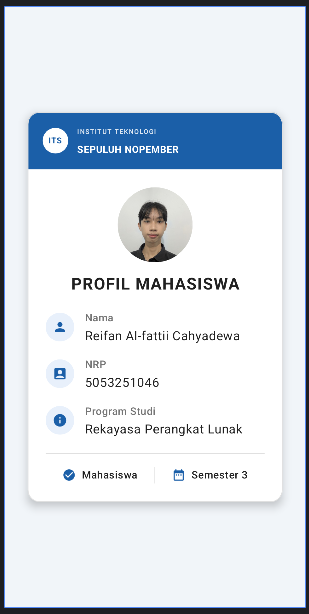

# Profile Card Mahasiswa

Latihan Praktikum Android — membuat tampilan kartu profil mahasiswa sederhana menggunakan Jetpack Compose.

## Deskripsi

Aplikasi ini menampilkan satu kartu profil mahasiswa yang berisi foto, nama, NRP, program studi, dan status akademik. Seluruh tampilan dibangun sebagai UI statis: datanya ditulis langsung di dalam kode, tanpa database, tanpa API, dan tanpa komponen interaktif.

Tujuan latihannya adalah memahami cara menyusun antarmuka dengan pendekatan deklaratif di Jetpack Compose, khususnya penggunaan `Text`, `Column`, `Row`, dan `Modifier` untuk mengatur susunan, ukuran, jarak, dan warna komponen.

## Tampilan



## Teknologi yang Digunakan

| Komponen | Versi |
|---|---|
| Kotlin | 2.2.10 |
| Jetpack Compose BOM | 2026.02.01 |
| Material 3 | mengikuti BOM |
| Material Icons Core | 1.7.8 |
| Android Gradle Plugin | 9.3.2 |
| compileSdk / targetSdk | 37 |
| minSdk | 30 |
| Java | 11 |

Dikembangkan menggunakan Android Studio.

## Komponen Compose yang Dipakai

- **Text** — menampilkan judul, label, dan isi informasi
- **Column** — menyusun elemen secara vertikal
- **Row** — menyusun elemen secara horizontal
- **Modifier** — mengatur ukuran, padding, bentuk, dan warna latar
- **Card** — wadah kartu dengan sudut membulat dan border
- **Image** — menampilkan foto profil dengan pemotongan berbentuk lingkaran
- **Icon** — ikon pendamping pada tiap baris informasi
- **HorizontalDivider** dan **VerticalDivider** — garis pemisah
- **Box** dan **Spacer** — penempatan elemen dan pengatur jarak

## Struktur Layout

```
Column (Parent)
├── Row     (Header Kampus)
├── Image   (Foto Profil)
├── Text    (Judul: PROFIL MAHASISWA)
├── Column  (Informasi)
│   ├── Row (Nama)
│   ├── Row (NRP)
│   └── Row (Program Studi)
├── Divider
└── Row     (Status: Mahasiswa | Semester)
```

## Penjelasan Kode

Seluruh composable berada dalam satu berkas, `MainActivity.kt`, agar alur susunannya mudah diikuti.

| Composable | Peran |
|---|---|
| `MainContent` | Memusatkan kartu di tengah layar |
| `ProfileCard` | Kartu utama, memuat seluruh bagian secara berurutan |
| `HeaderKampus` | Baris logo dan nama institusi di bagian atas kartu |
| `FotoProfil` | Foto profil lingkaran berukuran 100 dp |
| `InfoRow` | Satu baris informasi berisi ikon, label, dan isi. Dipakai ulang untuk Nama, NRP, dan Program Studi |
| `StatusRow` dan `StatusItem` | Baris status di bagian bawah kartu |

Data mahasiswa disimpan sebagai konstanta di bagian atas berkas, sehingga isinya dapat diganti tanpa menyentuh susunan tampilan. Warna diletakkan terpisah pada `ui/theme/Color.kt`.

Pada `Theme.kt`, opsi `dynamicColor` dinonaktifkan supaya warna kartu tetap sesuai spesifikasi desain dan tidak ikut berubah mengikuti warna wallpaper perangkat pada Android 12 ke atas.

## Spesifikasi Desain

| Properti | Nilai |
|---|---|
| Lebar kartu | 340 dp |
| Padding kartu | 24 dp |
| Sudut membulat | 16 dp |
| Latar kartu | `#FFFFFF` |
| Border dan divider | `#E0E0E0` |
| Teks utama | `#212121` |
| Teks sekunder | `#757575` |
| Ukuran foto | 100 dp, berbentuk lingkaran |
| Judul | 22 sp, tebal |
| Label informasi | 14 sp, medium |
| Isi informasi | 17 sp, reguler |
| Ketebalan divider | 1 dp |

## Struktur Proyek

```
app/src/main/
├── java/com/example/profile_card/
│   ├── MainActivity.kt
│   └── ui/theme/
│       ├── Color.kt
│       ├── Theme.kt
│       └── Type.kt
└── res/
    ├── drawable/foto_profil.jpg
    └── values/strings.xml

docs/screenshot.png
```

## Cara Menjalankan

1. Buka proyek pada Android Studio, lalu tunggu proses Gradle sync selesai.
2. Jalankan pada emulator atau perangkat dengan Android 11 (API 30) ke atas.
3. Tampilan juga dapat dilihat tanpa menjalankan aplikasi melalui panel Preview pada `ProfileCardPreview` di `MainActivity.kt`.

Melalui terminal:

```bash
./gradlew assembleDebug
```

Berkas APK akan tersedia di `app/build/outputs/apk/debug/`.

## Penulis

Reifan Al-fattii Cahyadewa — 5053251046
Rekayasa Perangkat Lunak, Institut Teknologi Sepuluh Nopember
